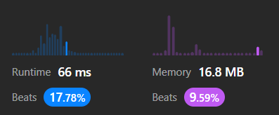

# Arrays and Hashing <!-- omit in toc -->

- [217. Contains Duplicate](#217-contains-duplicate)
- [242. Valid Anagram](#242-valid-anagram)
- [1. Two Sum](#1-two-sum)
- [49. Group Anagrams](#49-group-anagrams)
- [347. Top K Frequent Elements](#347-top-k-frequent-elements)


## 217. Contains Duplicate

Given an integer array nums, return true if any value appears at least twice in the array, and return false if every element is distinct. ([->](https://leetcode.com/problems/contains-duplicate/))

- Example 1:
  - Input: nums = [1,2,3,1]
  - Output: true
- Example 2:
  - Input: nums = [1,2,3,4]
  - Output: false
- Example 3:

  - Input: nums = [1,1,1,3,3,4,3,2,4,2]
  - Output: true

- Constraints:
  - 1 <= nums.length <= 10<sup>5</sup>
    -10<sup>9</sup> <= nums[i] <= 10<sup>9</sup>

**Preguntas clave**

**Desarrollo**

Nuestra primera aproximación para el método `containsDuplicate()` fue muy ingenua:

```py
def containsDuplicate(self, nums: list[int]) -> bool:
    for i, x in enumerate(nums[:-1]):
        for y in nums[i+1:]:
            if x == y:
                return True
        return False
```

Eseta es una mejore aproximación:

```py
def containsDuplicate(self, nums: list[int]) -> bool:
    hashset = set()
    for x in nums:            
        if x in hashset:
            return True
        hashset.add(x)
    return False
```

## 242. Valid Anagram

**Desarrollo**

```py
def isAnagram(self, s: str, t: str) -> bool:
    sSort = list(s)
    sSort.sort()
    tSort = list(t)
    tSort.sort()
    
    if sSort == tSort:
        return True
    return False
```


```py
def strToDict(s: str) -> dict:
    sDict = {}
    for e in list(s):
        if e in sDict:                
            sDict[e] += 1
        else:
            sDict[e] = 1
    return sDict

```


```py
def isAnagram(self, s: str, t: str) -> bool:
    if len(s) != len(t):
        return False
    ...
```


```py
def strToDict(s: str) -> dict:
    sDict = {}
    for e in s:
        sDict[e] = 1 + sDict.get(e, 0)
    return sDict
```



## 1. Two Sum

Given an array of integers `nums` and an integer `target`, return indices of the two numbers such that they add up to `target`.

You may assume that each input would have exactly one solution, and you may not use the same element twice.

You can return the answer in any order.

**Desarrollo**

Este es nuestro primer intento, muy ingenuo:

```py
def twoSum(self, nums: list[int], target: int) -> list[int]:
    for i, x in enumerate(nums[:-1]):           # O(n)
        for j, y in enumerate(nums[i+1:]):      # O(n)
            if x + y == target:
                return [i, 1+i+j]
```


En el siguiente intento uso la técnica de los dos punteros. Para ello es necesario ordenar la lista y, como nos piden índices, debemos poder rastrear de qué posición vino un número. Antes de ordenar la lista podemos usar la función `enumerate()` para emparejar en tuplas índices y valores. Podríamos usar el método `list.sort()` o `sorted()`. Usamos el segundo porque no ordena la lista modificando la original, sino que la entrega como valor de retorno.

https://stackoverflow.com/questions/6422700/how-to-get-indices-of-a-sorted-array-in-python

```py
def twoSum(self, nums: list[int], target: int) -> list[int]:
    nums = sorted(enumerate(nums), key= lambda x: x[1])
    # r + l < n (r: avance de i; l: avance de j)
    for i in nums:                      # O(right)
        for j in nums[::-1]:            # O(left)
            if i[1] + j[1] < target:    
                break
            elif i[1] + j[1] > target:
                continue
            else:
                r = [i[0], j[0]]
                r.sort()
                return r
        
```


```py
def twoSum(self, nums: list[int], target: int) -> list[int]:
    numsSet = set(nums)
    copy = numsSet.copy()
    for x in numsSet:
        if target - x in copy:
            if x != target - x:
                ind1 = nums.index(x)
                ind2 = nums.index(target - x)
                r = [ind1, ind2]
                r.sort()
                return r
            else:
                ind1 = nums.index(x)
                nums.pop(ind1)
                nums.insert(ind1, None)
                try:
                    ind2 = nums.index(target - x)
                except:
                    copy.remove(x)
                    continue
                r = [ind1, ind2]
                r.sort()
                return r
        copy.remove(x)
```


No estamos obligados a crear una copia para eliminar los elementos visitados. Si no lo hacemos, liberamos un poco de memoria a cambia de un poco de velocidad.

```py
def twoSum(self, nums: list[int], target: int) -> list[int]:
    numsSet = set(nums)
    for x in numsSet:
        if target - x in numsSet:
            if x != target - x:
                ind1 = nums.index(x)
                ind2 = nums.index(target - x)                    
            else:
                ind1 = nums.index(x)
                nums.pop(ind1)
                nums.insert(ind1, None)
                try:
                    ind2 = nums.index(target - x)
                except ValueError:
                    continue
            r = [ind1, ind2]
            r.sort()
            return r
```


## 49. Group Anagrams

```py
def groupAnagrams(self, strs: list[str]) -> list[list[str]]:
    groups = []
        groupDict = {}
        for str in strs:
            frec = {}
            for c in str:
                frec[c] = 1 + frec.get(c, 0)
            frec = tuple(sorted(frec.items())) # make frec hashable
            index = groupDict.get(frec)
            if index is None:
                index = len(groups)
                groups.append([])                
                groupDict[frec] = index           
            groups[index].append(str)
        return groups
```


¿Qué habría pasado si en la línea A hubieramos no hubieramos usado el método `dict.items()`? ¿Qué tal si en su lugar hubieramos usado el contructor `list()`? De hecho, habría hecho esto si no lo hubiera buscado en un foro:

```py
frec = tuple(sorted(list(frec)))
```

Lo que hace `list(frec)` no es convertir el diccionario `frec` en una lista de sus pares clave-valor, como es natural pensar. En su lugar, nos da una lista solo de las claves. Y, aunque no lo parezca, casi pasa todos los casos de prueba:


Pero ¿qué rayos es lo que salió mal? Lo que hice en su momento para saberlo fue una depuración del código de prueba. Nunca en mi vida había hecho algo así. Se puede decir que refactorice mis pruebas unitarias hasta cierto punto, y eso hace que su implementación sea legible:


Pero el mensaje de error que mostré antes no es legible. El módulo `DeepDiff` es fantástico para comparar cosas, pero cuando no son iguales es difícil saber en qué difieren. Entonces queremos personalizar el mensaje de error _AssertionError_. Para ello modificamos el método `assertEqualIgnoringOrder()`:

```py
def assertEqualIgnoringOrder(self, results: list[str], expected: list[str]):
    for i, result in enumerate(results):
        if DeepDiff(result, expected[i], ignore_order=True) != {}:
            info = f'''Lists are not equal ignoring order.
            result =   {result}
            expected = {expected[i]}
            '''
            assert False, info
```


Y ahora el mensaje de error es mucho más claro:


Se puede comparar fácilmente el resultado con el valor esperado para encontrar su diferencia.

**Versión 2**

Hay dos cosas que podríamos refactorizar. La primera es que no tiene mucho sentido separar las tuplas de conteo y los grupos de anagramas estableciendo una variable intermedia `index`. ¿Por qué no crear un diccionario en donde la clave es la tupla y el valor es una lista de anagramas del mismo grupo? Eso es lo primero que simplificamos.

Y lo segundo es que es un poco feo establecer como valor para cada nueva clave una lista vacía. Si `d` es un diccionario normal, entonces ```d["nueva clave"] = "valor"``` es posible, pero ```d["nueva clave"].append("valor")``` arroja el error `KeyError`. Investigando sobre diccionarios encontramos un módulo llamado `defaultdict`, que maneja por nosotros el KeyError al establecer un valor por defecto parea una nueva clave. Este valor por defecto no se puede pasar directamente, sino que lo tiene que entregar un método o función pasado por referencia (sin los paréntesis de llamada). Usamos `list`, pero podríamos haber usado `lambda: []`.

Este es el resultado:

```py
from collections import defaultdict
class Solution:
    def groupAnagrams(self, strs: list[str]) -> list[list[str]]:
        groups = defaultdict(list) # It's a wrapper: group["new key"] == [] (default value)
        for s in strs:
            frec = {}
            for c in s:
                frec[c] = 1 + frec.get(c, 0)
            frec = tuple(sorted(frec.items())) # make frec hashable            
            groups[frec].append(s)
        return list(groups.values())
```


No mejoró en nada el rendimiento, pero sí la legibilidad.

**Versión 3**

Esto es casi lo que se presenta como solución. Como se ve, no es muy distinto a lo que obtuvimos en la anterior versión. Disminuye ligeramente el consumo de memoria.

```py
def groupAnagrams(self, strs: list[str]) -> list[list[str]]:
    groups = defaultdict(list) # It's a wrapper: group["new key"] == [] (default value)
    for s in strs:
        frec = [0] * 26 # english alphabet
        for c in s:
            c = ord(c) - ord("a") # char ascii position relative to "a"
            frec[c] += 1
        frec = tuple(frec)  # make frec hashable
        groups[frec].append(s)
    return list(groups.values())
```


## 347. Top K Frequent Elements

```py
def topKFrequent(self, nums: list[int], k: int) -> list[int]:
    freq = {}
    for n in nums:
        freq[n] = 1 + freq.get(n, 0)
    freq = sorted(freq.items(), key = lambda x: x[1] , reverse = True)
    return [i for i, j in freq[:k]]
```


```py
def topKFrequent(self, nums: list[int], k: int) -> list[int]:
    freq = {}
    for n in nums:
        freq[n] = 1 + freq.get(n, 0)
    res = []
    for i in range(k):
        t = max(freq, key = lambda x: freq[x])
        freq.pop(t)
        res.append(t)
    return res
```


¿El algoritmo bucket sort será mejor?