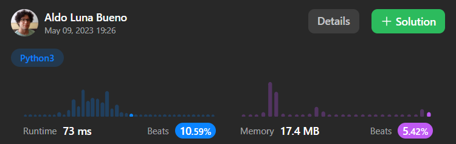
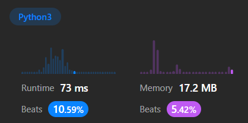

# Arrays and Hashing

## 217. Contains Duplicate

Given an integer array nums, return true if any value appears at least twice in the array, and return false if every element is distinct. ([->](https://leetcode.com/problems/contains-duplicate/))

- Example 1:
  - Input: nums = [1,2,3,1]
  - Output: true
- Example 2:
  - Input: nums = [1,2,3,4]
  - Output: false
- Example 3:

  - Input: nums = [1,1,1,3,3,4,3,2,4,2]
  - Output: true

- Constraints:
  - 1 <= nums.length <= 10<sup>5</sup>
    -10<sup>9</sup> <= nums[i] <= 10<sup>9</sup>

**Preguntas clave**

**Desarrollo**

Nuestra primera aproximación para el método `containsDuplicate()` fue muy ingenua:

```py
def containsDuplicate(self, nums: list[int]) -> bool:
    for i, x in enumerate(nums[:-1]):
        for y in nums[i+1:]:
            if x == y:
                return True
        return False
```

Eseta es una mejore aproximación:

```py
def containsDuplicate(self, nums: list[int]) -> bool:
    hashset = set()
    for x in nums:            
        if x in hashset:
            return True
        hashset.add(x)
    return False
```

## 242. Valid Anagram

**Desarrollo**

```py
def isAnagram(self, s: str, t: str) -> bool:
    sSort = list(s)
    sSort.sort()
    tSort = list(t)
    tSort.sort()
    
    if sSort == tSort:
        return True
    return False
```




```py
def strToDict(s: str) -> dict:
    sDict = {}
    for e in list(s):
        if e in sDict:                
            sDict[e] += 1
        else:
            sDict[e] = 1
    return sDict

```



```py
def isAnagram(self, s: str, t: str) -> bool:
    if len(s) != len(t):
        return False
    ...
```


```py
def strToDict(s: str) -> dict:
    sDict = {}
    for e in s:
        sDict[e] = 1 + sDict.get(e, 0)
    return sDict
```


## Two Sum

Given an array of integers `nums` and an integer `target`, return indices of the two numbers such that they add up to `target`.

You may assume that each input would have exactly one solution, and you may not use the same element twice.

You can return the answer in any order.

**Desarrollo**

Este es nuestro primer intento, muy ingenuo:

```py
def twoSum(self, nums: list[int], target: int) -> list[int]: # n := len(nums) | O(n^2)
    for i, x in enumerate(nums[:-1]):           # O(n)
        for j, y in enumerate(nums[i+1:]):      # O(n)
            if x + y == target:
                return [i, 1+i+j]
```


En el siguiente intento uso la técnica de los dos punteros. Para ello es necesario ordenar la lista y, como nos piden índices, debemos poder rastrear de qué posición vino un número. Antes de ordenar la lista podemos usar la función `enumerate()` para emparejar en tuplas índices y valores. Podríamos usar el método `list.sort()` o `sorted()`. Usamos el segundo porque no ordena la lista modificando la original, sino que la entrega como valor de retorno.

https://stackoverflow.com/questions/6422700/how-to-get-indices-of-a-sorted-array-in-python

```py
def twoSum(self, nums: list[int], target: int) -> list[int]: # n := len(nums) | O(n)
    nums = sorted(enumerate(nums), key= lambda x: x[1])
    for i in nums:                      # O(r)
        for j in nums[::-1]:            # O(l), donde r + l < n (r: avance de i; l: avance de j)
            if i[1] + j[1] < target:    
                break
            elif i[1] + j[1] > target:
                continue
            else:
                r = [i[0], j[0]]
                r.sort()
                return r
```

