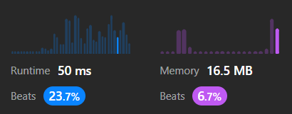
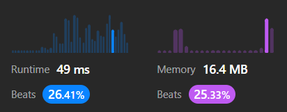
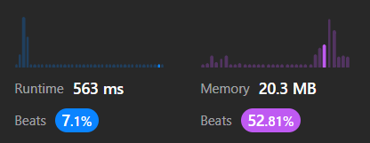
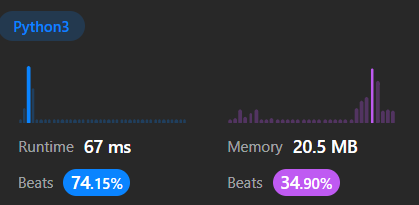
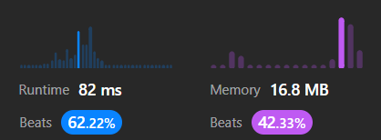
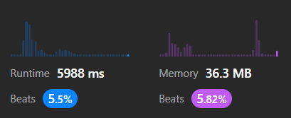
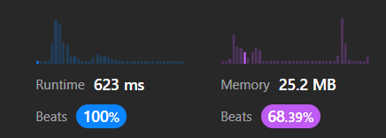
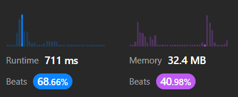

## Valid Stack

```python
closeToOpen = {
            ")": "(",
            "]": "[",
            "}": "{"
        }
        stack = []
        for c in s:
            if len(stack) == 0:
                stack.append(c)
                continue
            if c not in closeToOpen:
                stack.append(c)
            else:
                if closeToOpen[c] != stack[-1]:
                    return False
                else:
                    stack.pop()                
        return stack == []
```



Un pequeño ajuste hizo la diferencia:

```python
stack = [" "]
for c in s:
    if c not in closeToOpen:
        stack.append(c)
```



## Min Stack

```python
class MinStack:
    def __init__(self):
        self.arr = []

    def push(self, val: int) -> None:
        self.arr.append(val)

    def pop(self) -> None:
        self.arr.pop()

    def top(self) -> int:
        return self.arr[-1]

    def getMin(self) -> int:
        return min(self.arr)
```



```python
class MinStack:
    def __init__(self):
        self.arr = []
        self.eachMin = [2**31-1]

    def push(self, val: int) -> None:
        self.arr.append(val)
        if val < self.eachMin[-1]:
            self.eachMin.append(val)
        else:
            self.eachMin.append(self.eachMin[-1])

    def pop(self) -> None:
        self.arr.pop()
        self.eachMin.pop()

    def top(self) -> int:
        return self.arr[-1]

    def getMin(self) -> int:
        return self.eachMin[-1]
```




## Evaluating reverse Polish notation



## Largest rectangle in histogram

**Versión 1**

```python
def largestRectangleArea(self, heights: List[int]) -> int:
    max_area = 0
    min_indices = [-1, len(heights)]
    indices_by_height = [i[0] for i in sorted(enumerate(heights), key = lambda x:x[1])]
    curr_ind = 0
    while curr_ind < len(indices_by_height):
        curr_height = heights[indices_by_height[curr_ind]]
        min_indices_copy = min_indices[:]
        while (curr_ind < len(indices_by_height) 
                and curr_height == heights[indices_by_height[curr_ind]]):
            ind_of_indices = bisect(min_indices, indices_by_height[curr_ind])
            lim_sup = min_indices[ind_of_indices]
            lim_inf = min_indices[ind_of_indices-1]
            curr_area = (lim_sup - lim_inf - 1) * curr_height
            if curr_area > max_area:
                max_area = curr_area                
            min_indices_copy.insert(ind_of_indices, indices_by_height[curr_ind])
            curr_ind += 1
            min_indices = min_indices_copy           
    return max_area
```



**Versión 2**

```python
def largestRectangleArea(self, heights: List[int]) -> int:
    stack = [[-1, 0]]
    max_area = 0
    for i, h in enumerate(heights):

        i_stack, h_stack = stack[-1]

        if h_stack == h:
            continue
        if h_stack < h:
            stack.append([i, h])
            continue

        curr_area = 0
        i_stack_del = 0

        while h_stack > h:
            curr_area = (i - i_stack) * h_stack # A
            if curr_area > max_area:
                max_area = curr_area
            i_stack_del = i_stack
            stack.pop()
            i_stack, h_stack = stack[-1]

        if h_stack == h:
            continue
        if h_stack < h:
            stack.append([i_stack_del, h]) # B
        
    n = len(heights)
    for i_stack, h_stack in stack[:0:-1]: # C
        curr_area = (n - i_stack) * h_stack
        if curr_area > max_area:
            max_area = curr_area                
    return max_area
```



Explicación de las líneas A, B y C:

La línea B sirvió para pasar este caso de prueba: `([6, 2, 1, 4, 3, 5], 9)`. La variable *i_stack_del* es el índice del último item eliminado del stack.

**Versión 3**

Esta tercera versión es más corta y clara, pero menos eficiente que la anterior.

```python
def largestRectangleArea(self, heights: List[int]) -> int:
    maxArea = 0
    stack = [] # pair: (index, height)]

    for i, h in enumerate(heights):
        start = i
        while stack and stack[-1][1] > h:
            i_stack, h_stack = stack.pop()
            maxArea = max(maxArea, h_stack * (i - i_stack))
            start = i_stack # Guarda el índice del último elemento del stack eliminado
        stack.append((start, h))

    for i, h in stack:
        maxArea = max(maxArea, h * (len(heights) - i))
    
    return maxArea
```

