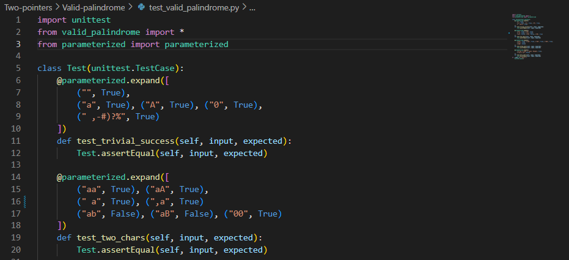
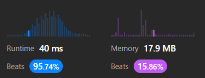
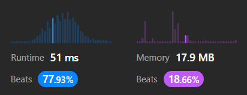
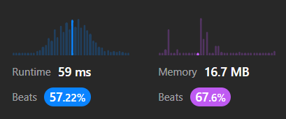
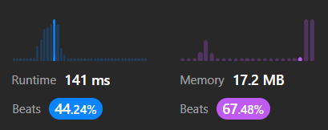
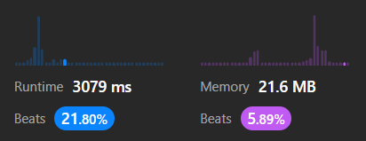
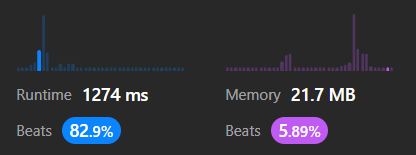

# Two Pointers <!-- omit in toc -->

- [125. Valid Palindrome](#125-valid-palindrome)
- [Two Sum II](#two-sum-ii)
- [3Sum](#3sum)

En este nivel del mapa de algoritmos vamos a usar otra biblioteca de pruebas llamada pytest. Hemos usado `assert` en algunas pruebas. Se recomienda usarlo para hacer testing [en esta página.](https://realpython.com/python-assert-statement/#testing-your-code-with-assertions)

## 125. Valid Palindrome



Intentamos usar la biblioteca _parameterized_ junto con _unittest_, pero encontramos problemas. El código de arriba no funciona bien. Concretamente, falla cuando, dentro de una anotación paramétrica, el primer parámetro de una tupla tiene caracteres no alfanuméricos, ya que ese dato no se supone que sea un parámetro, sino un nombre único para la tupla de datos (los nombres tienen reglas arbitrarias como esa).

Entonces, nos vemos obligados a usar, en vez de la simple anotación `@parameterized`, la más complicada `@parameterize.expand`. (¿Por qué? Porque la simple `@parameterized` no es compatible con _unittest_). Es más complicada porque al principio de cada combinación de entradas y valor esperado nos pide una cadena que sirva como identificador único. Creemos que esto va en contra del principio de las pruebas unitarias.

El principal beneficio de las pruebas unitarias es que se escriben rápido. Y lo que se supone que hacen las pruebas paramétricas es reducir la fricción de introducir nuevas combinaciones de entradas y salidas esperadas. Pero ¿qué ocurre si para cada nueva combinación tengo que especificar un identificador diferente? Que tenemos fricción innecesaria.


**Versión 1**

```python
def isPalindrome(self, s: str) -> bool:
    s = s.casefold()
    strArr = [c for c in s if c.isalnum()]
    strRev = strArr[::-1]
    return strArr == strRev
```



**Versión 2**

```python
def isPalindrome(self, s: str) -> bool:
    s = s.casefold()
    strArr = [c for c in s if c.isalnum()]
    half = len(strArr) // 2
    for i in range(half):
        if strArr[i] != strArr[-i-1]:
            return False
    return True
```




**Versión 3**

```python
def isPalindrome(self, s: str) -> bool:
        left, right = 0, len(s) -1 # Pointers
        while left < right:
            while left < right and not s[left].isalnum():
                left += 1
            while left < right and not s[right].isalnum():
                right += -1
            if s[left].lower() != s[right].lower():
                return False            
            left += 1
            right += -1
        return True
```



## Two Sum II

```python
def twoSum(self, numbers: list[int], target: int) -> list[int]:
        left, right = 0, len(numbers) -1
        while left < right:
            if numbers[left] + numbers[right] < target:
                left += 1
            elif numbers[left] + numbers[right] > target:
                right += -1
            else:
                return [left+1, right+1]
```



## 3Sum

```python
def threeSum(self, nums: list[int]) -> list[list[int]]:
    nums = sorted(nums)        
    res = set()
    n = len(nums)
    for k in range(n-2):
        i, j = k+1, n-1
        # Two sum
        target = -nums[k]
        while i < j:
            twoSum = nums[i] + nums[j]
            if twoSum < target:
                i += 1
            elif twoSum > target:
                j += -1
            else:
                res.add((nums[k], nums[i], nums[j]))
                i += 1 # A
    # Tuples to arrays
    res = [[*tup] for tup in res]
    return res
```



¿Qué hace la línea A y por qué?

Si la ejecución llega hasta la línea A, significa que encontramos un triplete que suma cero. ¿Debemos buscar ahora para otro valor de k? No, porque podría haber más tripletes que suman cero con el mismo k. Entonces, debemos seguir moviendo los punteros i y j a ver si encontramos más. El problema es que mover cualquiera de los punteros significa descartar soluciones. Si movemos i, estamos descartando los pares (i, j-1), (i, j-2)... ¿Esto es legítimo? Por supuesto. Como el arreglo está ordenado en forma creciente, hay dos casos posibles: nums[j-1] < nums[j] o nums[j-1] = nums[j]. En el primer caso, nums[i] +nums[j-1] < nums[i] +nums[j] = target, así que no hay problema en descartar los elementos j-1 hacia abajo. En el segundo caso, nums[i] +nums[j-1] = nums[i] +nums[j] = target, así que forman un triplete que suma cero junto con nums[k], ¡y lo estamos descartando! Pero esto no es un problema porque el enunciado nos pide que nose repita nigún triplete. Entonces, podemos mover i sin problemas. De hecho, también podríamos haber movido j en lugar de i.

**Versión 2**

```python

for k in range(n-2):
    if k>0 and nums[k] == nums[k-1]:
        continue
```

