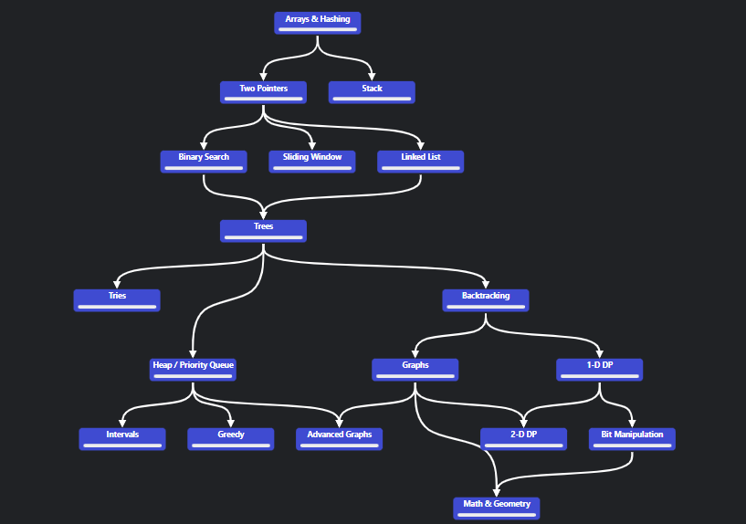

# Neetcode-150

En este repo voy a resolver los 150 problemas de la página [neetcode.io](https://neetcode.io/). Es una selección de problemas frecuentes en entrevistas, pero ordenados con buen criterio de forma temática y por dificultad. El propósito es refozar mi aprendizaje poniendo en práctica lo que sé.

A través de esta página se puede acceder fácilmente a las soluciones. Mi idea no es copiar nada de eso, sino ver lo necesario para implementar todo yo mismo. 

Mi aporte será que agregaré pruebas unitarias siguiendo la metodologías como [TDD](https://en.wikipedia.org/wiki/Test-driven_development#:~:text=Test%2Ddriven%20development%20(TDD),software%20against%20all%20test%20cases) y [RGR](https://www.codecademy.com/article/tdd-red-green-refactor?periods=year&plan_id=proGoldAnnualV2&utm_source=pepperjam&utm_medium=affiliate&utm_term=96525&clickId=4376162537&pj_creativeid=8-12462&pj_publisherid=96525) y patrones como [AAA.](https://automationpanda.com/2020/07/07/arrange-act-assert-a-pattern-for-writing-good-tests/)

Este una buenísima referencia que encontré acerca del uso de la biblioteca _unittest_, que es la que usaré para todas las pruebas en Python:

<iframe width="560" height="315" src="https://www.youtube.com/embed/6tNS--WetLI" title="YouTube video player" frameborder="0" allow="accelerometer; autoplay; clipboard-write; encrypted-media; gyroscope; picture-in-picture; web-share" allowfullscreen></iframe>

Aparte de la implementación de las soluciones y las pruebas, también agregaré a cada pregunta explicaciones y preguntas clave para repasar más adelante. Así no se me olvidará cómo ataqué los problemas.

