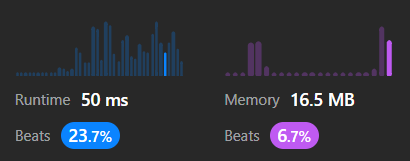
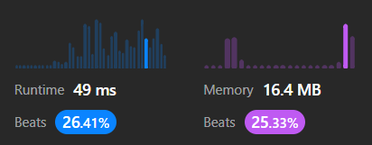
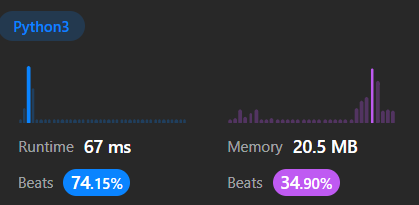

## Valid Stack

```python
closeToOpen = {
            ")": "(",
            "]": "[",
            "}": "{"
        }
        stack = []
        for c in s:
            if len(stack) == 0:
                stack.append(c)
                continue
            if c not in closeToOpen:
                stack.append(c)
            else:
                if closeToOpen[c] != stack[-1]:
                    return False
                else:
                    stack.pop()                
        return stack == []
```



Un pequeño ajuste hizo la diferencia:

```python
stack = [" "]
for c in s:
    if c not in closeToOpen:
        stack.append(c)
```



## Min Stack

```python
class MinStack:
    def __init__(self):
        self.arr = []

    def push(self, val: int) -> None:
        self.arr.append(val)

    def pop(self) -> None:
        self.arr.pop()

    def top(self) -> int:
        return self.arr[-1]

    def getMin(self) -> int:
        return min(self.arr)
```


```python
class MinStack:
    def __init__(self):
        self.arr = []
        self.eachMin = [2**31-1]

    def push(self, val: int) -> None:
        self.arr.append(val)
        if val < self.eachMin[-1]:
            self.eachMin.append(val)
        else:
            self.eachMin.append(self.eachMin[-1])

    def pop(self) -> None:
        self.arr.pop()
        self.eachMin.pop()

    def top(self) -> int:
        return self.arr[-1]

    def getMin(self) -> int:
        return self.eachMin[-1]
```


